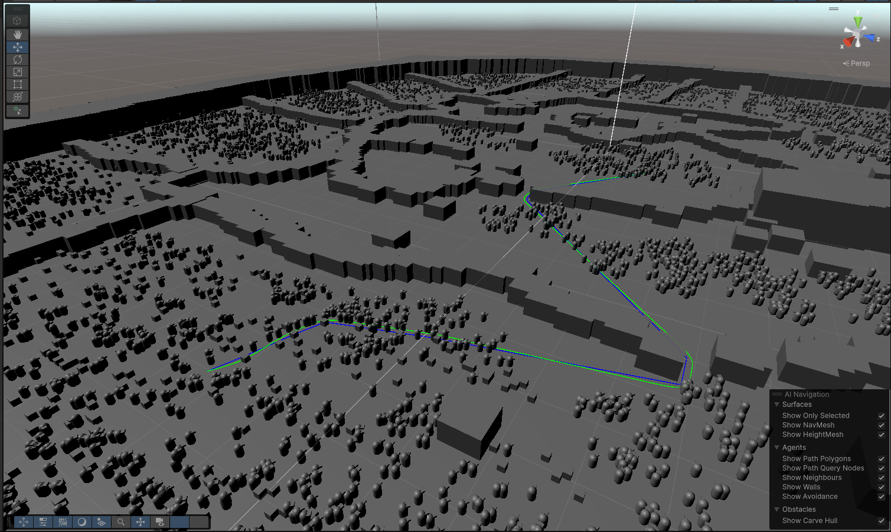

# ⚙️ DOTS Pathfinding

**DOTS Pathfinding** is a high-performance pathfinding system built on Unity DOTS, designed to efficiently handle large numbers of agents using multithreaded processing and runtime NavMesh generation.

The project focuses on **scalability, flexibility, and performance**, making it suitable for simulations and large-scale AI scenarios.

---

## 📸 Preview

[Watch on YouTube](https://youtu.be/i6ekFbw3Xck)
---

## 🚀 Key Features

### 🧭 NavMesh-Based Pathfinding
- Built on Unity NavMesh system
- Uses **NavMeshQuery** for path calculations
- Reliable and accurate navigation

---

### 🔄 Runtime NavMesh Baking
- Supports **runtime NavMesh generation**
- Includes:
    - DOTS world colliders
    - NavMesh modifiers
    - NavMesh cuts
- Keeps navigation data fully dynamic

---

### 🤖 Flexible Agent Movement
- Works with:
    - Transforms
    - Rigidbodies
- Easily adaptable to different movement systems

---

### 📡 Advanced Path Request System
Highly customizable path request logic:
- Automatic path updates based on:
    - Distance to destination
    - Time intervals
- Manual path requests
- Fine control over when and how paths are recalculated

---

### 🧩 Path Modifiers
- Post-processing of calculated paths
- Supports:
    - Path smoothing
    - Corner adjustments
- Allows custom modifier pipelines

---

### ⚡ Fully Multithreaded
- Built with DOTS and Jobs system
- Utilizes **all available CPU cores**
- Designed for handling large numbers of agents simultaneously

---

### 🎛️ Performance Controls
- Configurable limits:
    - Number of paths processed per frame
    - Iterations per path search per frame
- Lets you balance:
    - Performance
    - Responsiveness

---

## 🧠 Technical Highlights

- DOTS (ECS + Jobs + Burst)
- NavMeshQuery integration
- Runtime navigation data generation
- Scalable multi-agent pathfinding
- Custom scheduling and throttling system
